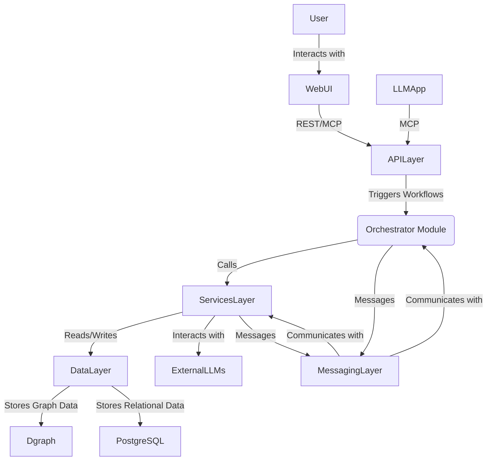

# SDA Module Specification: Software Development Analytics

## 1. Module Overview

The Software Development Analytics (SDA) module is designed to provide a comprehensive platform for analyzing software development artifacts. It will leverage the existing `orchestrator` framework as a dependency for workflow management, integrate with the Model Context Protocol (MCP) for seamless interaction with Large Language Models (LLMs), and offer a web-based user interface for intuitive control and visualization. The module aims to deliver advanced analytical capabilities, including codebase analysis, document processing, and intelligent insights derived from LLM interactions.

## 2. Architectural Design

The SDA module will follow a layered, modular architecture to ensure scalability, maintainability, and extensibility.

*   **Presentation Layer (Web UI):** A React/TypeScript frontend providing an interactive interface for users to trigger analyses, manage repositories, view results, and monitor workflows.
*   **API Layer (FastAPI/MCP Server):** A Python-based backend exposing functionalities via RESTful APIs and an MCP server. This layer will serve as the primary interface for the Web UI and external LLM applications.
*   **Orchestration Layer (BPMN Engine - provided by `orchestrator`):** The core of the workflow management, utilizing the `orchestrator` module as a dependency. It will manage the execution of complex analytical workflows, task assignments, and process state.
*   **Services Layer:** A collection of modular Python services responsible for specific analytical tasks (e.g., Git operations, code analysis, PDF processing, LLM interactions). These services will be callable by the orchestration layer.
*   **Data Layer (Dgraph & PostgreSQL):**
    *   **Dgraph:** Used as the primary analytical data store for graph-based data (e.g., code dependencies, PDF document structure, BPMN process states). Its graph capabilities are ideal for representing complex relationships within software artifacts.
    *   **PostgreSQL:** Used for relational data storage, such as repository metadata, user configurations, and potentially aggregated analysis results.
*   **Messaging Layer (Redis):** Utilizes Redis streams for inter-component communication, particularly between the Orchestrator Core and worker agents, ensuring asynchronous and reliable message delivery.



## 3. Key Features

The SDA module will incorporate and expand upon the features explored in the `_reference_code`:

*   **Codebase Ingestion & Analysis:**
    *   **Git Integration:** Automated cloning, pulling, and management of Git repositories (`git_integration.py`).
    *   **Code Parsing & Chunking:** Breaking down source code into manageable units for analysis and embedding.
    *   **Semantic Search & RAG:** Performing semantic searches over code chunks and using Retrieval-Augmented Generation (RAG) for code-related queries (`analysis.py`).
    *   **Duplicate Code Detection:** Identifying and reporting similar or duplicate code snippets (`analysis.py`).
*   **Document Ingestion & Analysis:**
    *   **PDF Dissection:** Extracting text, images, and structural information from PDF documents (`pdf_dissection.py`).
    *   **Image Analysis:** (Future) Integration with vision models for embedding and analyzing images extracted from documents.
    *   **Document Semantic Search:** Enabling semantic search capabilities over ingested documents.
*   **Workflow Orchestration (via `orchestrator` module):**
    *   **BPMN-driven Workflows:** Defining and executing complex analytical processes using BPMN 2.0 definitions, managed by the `orchestrator`.
    *   **Dynamic Task Assignment:** Assigning tasks to available worker agents, managed by the `orchestrator`.
    *   **Process Monitoring:** Tracking the status and progress of running analytical workflows, managed by the `orchestrator`.
*   **LLM Integration:**
    *   **LLM Clients:** Integration with various Large Language Models. Rate limiting and cost tracking for LLM usage will be handled by the `orchestrator` module.
    *   **LLM-powered Analysis:** Utilizing LLMs for advanced reasoning, summarization, and generation tasks based on extracted data.
*   **Interactive User Interface:**
    *   **Repository Management:** UI for adding, cloning, and managing Git repositories.
    *   **Workflow Triggering:** Initiating predefined analytical workflows (e.g., "Analyze Codebase," "Process Document") via the `orchestrator`.
    *   **Results Visualization:** Displaying analysis results in an intuitive and interactive manner (e.g., code duplicate reports, PDF structure views).
    *   **Process Monitoring Dashboard:** Real-time view of active processes, task statuses, and worker agent health, provided by the `orchestrator`.

## 4. MCP Server Design

The MCP server will be a central component, exposing SDA functionalities as tools and resources to LLM applications and potentially other MCP clients.

*   **MCP Tools:**
    *   `analyze_codebase(repo_url: str, branch: str)`: Triggers a full codebase analysis workflow.
    *   `find_duplicate_code(repo_id: str, branch: str, threshold: float)`: Initiates duplicate code detection.
    *   `search_code_snippet(repo_id: str, branch: str, query: str)`: Performs a semantic search for code snippets.
    *   `dissect_pdf(pdf_path: str)`: Triggers PDF content extraction.
    *   `get_workflow_status(process_id: str)`: Retrieves the current status of an analytical workflow (delegated to `orchestrator`).
    *   `list_repositories()`: Lists all managed Git repositories.
    *   `checkout_branch(repo_id: str, branch_name: str)`: Checks out a specific branch in a managed repository.
*   **MCP Resources:**
    *   `repository://{repo_id}`: Provides metadata and status of a specific Git repository.
    *   `analysis_result://{analysis_id}`: Returns the results of a completed analysis.
    *   `pdf_document://{document_id}`: Provides structured data from a dissected PDF.
    *   `workflow_log://{process_id}`: Streams logs and events for a running workflow (delegated to `orchestrator`).
*   **MCP Prompts:**
    *   `code_review_prompt(code_snippet: str, context: str)`: A prompt template for LLMs to perform code reviews.
    *   `document_summary_prompt(document_id: str)`: A prompt template for LLMs to summarize documents.

## 5. Data Models

The module will utilize a combination of Dgraph and PostgreSQL for data persistence.

*   **Dgraph Models (Graph-based):**
    *   **Codebase Graph:**
        *   `Repository`: Nodes representing Git repositories.
        *   `File`: Nodes for individual files within a repository.
        *   `CodeChunk`: Nodes for extracted code chunks (with embeddings).
        *   `Symbol`: Nodes for identified symbols (functions, classes, variables).
        *   Relationships: `CONTAINS` (Repo -> File), `HAS_CHUNK` (File -> CodeChunk), `DEFINES` (File -> Symbol), `REFERENCES` (CodeChunk -> Symbol), `SIMILAR_TO` (CodeChunk -> CodeChunk for duplicates).
    *   **Document Graph:**
        *   `Document`: Nodes for ingested documents (e.g., PDFs).
        *   `Page`: Nodes for individual pages.
        *   `TextSegment`: Nodes for extracted text blocks.
        *   `Image`: Nodes for extracted images (with embeddings).
        *   Relationships: `HAS_PAGE` (Document -> Page), `CONTAINS_TEXT` (Page -> TextSegment), `CONTAINS_IMAGE` (Page -> Image).
    *   **BPMN Process Graph (managed by `orchestrator`):**
        *   `ProcessInstance`: Nodes representing running BPMN processes.
        *   `TaskInstance`: Nodes for individual tasks within a process.
        *   `EventInstance`: Nodes for events.
        *   `GatewayInstance`: Nodes for gateways.
        *   `Agent`: Nodes for worker agents.
        *   Relationships: `HAS_TASK`, `HAS_EVENT`, `HAS_GATEWAY`, `ASSIGNED_TO` (Task -> Agent), `FOLLOWS` (SequenceFlow).
*   **PostgreSQL Models (Relational):**
    *   `RepositoryMetadata`: Stores Git repository URLs, local paths, last sync times, etc.
    *   `AnalysisJob`: Records details of initiated analysis jobs (type, status, parameters).
    *   `UserConfiguration`: Stores user-specific settings and preferences.
    *   `orchestrator` will manage `LLMUsageLog` and other general operational logs.

## 6. Proposed Project Structure

The new SDA module will reside in the `root/sda` directory, following a clear and organized structure.

```
C:/Users/vdonc/AMI-SDA/
├───sda/
│   ├───__init__.py
│   ├───main.py                 # Entry point for the SDA module (e.g., FastAPI app)
│   ├───config.py               # Module-wide configuration
│   ├───requirements.txt        # Python dependencies for the SDA module
│   ├───.env.example            # Example environment variables
│   │
│   ├───core/
│   │   ├───__init__.py
│   │   ├───models/             # Pydantic/SQLAlchemy models for data structures
│   │   │   ├───__init__.py
│   │   │   ├───data_models.py  # Models for analysis results (e.g., SemanticSearchResult, DuplicatePair)
│   │   │   └───db_models.py    # SQLAlchemy ORM models for PostgreSQL
│   │   ├───config/             # Configuration classes (e.g., AIConfig, LLMConfig)
│   │   │   ├───__init__.py
│   │   │   └───settings.py
│   │   ├───db/                 # Database management utilities
│   │   │   ├───__init__.py
│   │   │   ├───db_manager.py   # PostgreSQL connection and session management
│   │   │   └───dgraph_client.py # Dgraph client (migrated and adapted)
│   │   └───utils/              # General utilities (e.g., logging setup)
│   │       ├───__init__.py
│   │
│   ├───services/               # Business logic for specific analytical tasks
│   │   ├───__init__.py
│   │   ├───analysis.py         # Code analysis, semantic search, duplicate detection
│   │   ├───pdf_dissection.py   # PDF content extraction
│   │   ├───git_integration.py  # Git operations
│   │   └───ingestion/          # Data ingestion pipelines
│   │       ├───__init__.py
│   │       ├───code_ingestion.py
│   │       └───document_ingestion.py
│   │
│   ├───api/                    # FastAPI application and MCP server
│   │   ├───__init__.py
│   │   ├───main.py             # FastAPI app definition
│   │   ├───routes.py           # API endpoints
│   │   └───mcp_server.py       # MCP server definition (exposing tools/resources)
│   │
│   ├───ui/                     # Web-based user interface (React/TypeScript)
│   │   ├───public/             # Static assets (index.html, favicon, etc.)
│   │   │   └───index.html
│   │   └───src/                # React source code
│   │       ├───__init__.py
│   │       ├───App.tsx
│   │       ├───components/
│   │       ├───pages/
│   │       └───services/       # Frontend services for API interaction
│   │
│   ├───bpmn_definitions/       # BPMN process definition files (e.g., .json, .bpmn)
│   │   └───sample_analysis_workflow.json
│   │
│   └───docs/                   # Module-specific documentation
│       ├───__init__.py
│       ├───design_document.md  # This specification document
│       ├───api_reference.md
│       └───usage_guide.md
│
└───tests/                      # Unit, integration, and end-to-end tests
    ├───__init__.py
    ├───unit/
    ├───integration/
    └───e2e/
```

## 7. Core Workflows

Here are examples of core analytical workflows that the SDA module will support:

### Workflow 1: Codebase Analysis

1.  **User Action (UI/MCP Tool):** User initiates "Analyze Codebase" for a given Git repository URL and branch.
    *   UI: Clicks a button, provides URL/branch.
    *   MCP Tool: LLM calls `analyze_codebase(repo_url, branch)`.
2.  **Orchestrator Trigger:** The API layer receives the request and triggers a BPMN process instance for "Codebase Analysis" via the `orchestrator` module.
3.  **Git Clone/Pull Task:** An `orchestrator` task is assigned to a worker agent to clone or pull the specified repository.
4.  **Code Ingestion Task:** Once the repository is local, another task is assigned to ingest the code:
    *   Parse files, extract code chunks, and identify symbols.
    *   Generate embeddings for code chunks.
    *   Store code structure, chunks, and embeddings in Dgraph.
5.  **Duplicate Code Detection Task:** A task runs the duplicate code detection service on the ingested code.
    *   Results (duplicate pairs) are stored in PostgreSQL and/or Dgraph.
6.  **LLM-powered Insights Task:** An LLM-powered task might analyze specific code sections or generate summaries.
7.  **Results Aggregation & Storage:** All analysis results are aggregated and stored in the Data Layer.
8.  **Notification/UI Update:** The UI is updated with the analysis status and results. If triggered by MCP, the results are returned via the MCP resource.

### Workflow 2: Document Processing (PDF)

1.  **User Action (UI/MCP Tool):** User uploads a PDF or provides a path, initiating "Process Document."
    *   UI: Uploads file.
    *   MCP Tool: LLM calls `dissect_pdf(pdf_path)`.
2.  **Orchestrator Trigger:** A BPMN process instance for "Document Processing" is triggered via the `orchestrator` module.
3.  **PDF Dissection Task:** A worker agent executes the `pdf_dissection.py` service:
    *   Extracts text content, images, and structural information.
    *   (Future) Generates embeddings for text segments and images.
    *   Stores the structured PDF data (nodes, relationships) in Dgraph.
4.  **LLM-powered Summarization/Q&A Task:** An LLM-powered task might summarize the document or enable Q&A over its content.
5.  **Results Storage:** The processed document data and any LLM-generated insights are stored.
6.  **Notification/UI Update:** The UI displays the processed document structure and allows interaction.
